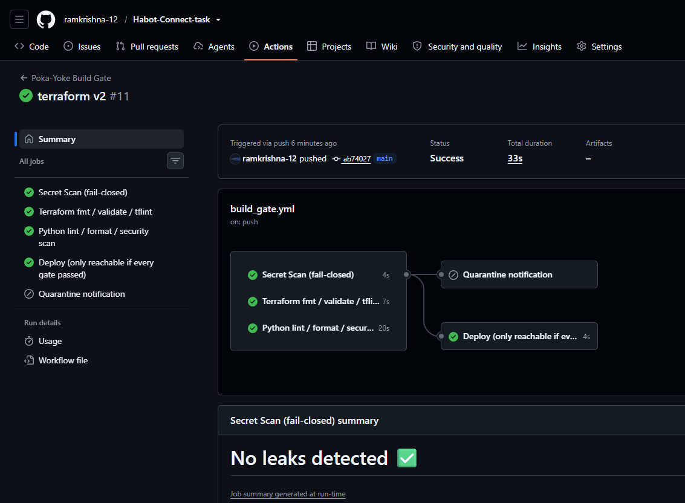

# HabotConnect — Secure Staging Restoration Blueprint

**Candidate:** Ramkrishna Roy Barman  · linkedin.com/in/ramkrishna-roy-barman-48391b16a · github.com/ramkrishna-12
**Position:** Junior Cloud & DevOps Engineer (GCP / Django / React)
**Submission for:** Habot Connect FZCO Hiring Project, deadline 13-Sept-2026

---

## The scenario, restated

A developer pushed hardcoded API credentials into application code and a
schema mismatch broke downstream analytics. This blueprint closes both
holes structurally — not with a review checklist, but with mechanisms
that make the mistake physically unable to reach production (Poka-Yoke).

## Folder layout

```
habot-hiring-project/
├── README.md                                  (this file)
├── terraform/
│   ├── main.tf            Task 1 — D0 GCS bucket + D1 BigQuery dataset/table, IAM, RLS
│   ├── variables.tf
│   └── outputs.tf
├── .github/
│   └── workflows/build-gate.yml       Task 2 — fail-closed Poka-Yoke gate
└── django/
    ├── dcyn_library.py                        Task 3 — binary Yes/No decision primitives
    ├── serializers.py                         Task 3 — DRF serializer + DCYN deconstruction
    ├── models.py                              Task 3 — enforced D1 record shape
    └── tests.py                               Task 3 — proof the fail-closed paths reject
```

## Architecture

```text
Student onboarding application
            |
            v
      CI/CD Build Gate
  +-----------------------+
  | format + lint         |
  | secret scan           |
  | Terraform validation  |
  | infrastructure scan   |
  +-----------+-----------+
              |
       PASS / FAIL-CLOSED
              |
              v
       GCP staging layer
   +-----------------------+
   | GCS D0 Raw Landing    |
   |         |             |
   |         v             |
   | Pub/Sub / ingestion   |
   |         |             |
   |         v             |
   | BigQuery D1           |
   | Staged/Enforced       |
   | + Row-Level Security  |
   +-----------------------+
              ^
              |
      Django serializer
      + DCYN validation
```

---

## Task 1 — Terraform Secure Staging Provisioning

**D0 (raw landing, GCS)** and **D1 (staged/enforced, BigQuery)** are provisioned
with three identities, each scoped to exactly one stage of the pipeline:

| Identity | Can do | Cannot do |
|---|---|---|
| `d0-ingest-writer` | Create new objects under `incoming/` | Read, list, overwrite, or touch BigQuery |
| `d1-bq-loader` | Read objects created in the last 24h, write to D1 | Read older objects, read D0 outside `incoming/` |
| `d1-analytics-reader` | SELECT on D1, filtered by Row-Level Security | Write anywhere, see rows outside its assigned region |

Key mechanisms, and *why* each one is there rather than a broader default:

- **IAM Conditions, not role grants alone.** The ingest writer's binding is
  restricted to the `incoming/` prefix by a `condition` block — a
  compromised writer credential can still only ever create new files in
  one place, it can never read what's already landed.
- **A time-boxed read window for the loader.** Its `objectViewer` binding
  expires access to any object older than 24h. A forgotten, stale file
  can't be silently reprocessed by a future pipeline run.
- **CMEK, not Google-default encryption**, on both the bucket and the
  dataset — the payload includes disability/learning-difficulty status,
  which is exactly the kind of field that shouldn't rely on a default.
- **Row-Level Security (`google_bigquery_row_access_policy`)** on the
  enforced table. This is deliberately *not* just an IAM grant: even
  though the analytics reader has `dataViewer` on the whole table, GCP
  evaluates the row filter on every query against an `analyst_region_map`
  lookup table. A dataViewer role alone would let an analyst run
  `SELECT *` and see every region; RLS is what actually stops that.
- **Remote state (`backend "gcs"`)**, because local state for a resource
  holding student PII has no audit trail and is one laptop backup away
  from a data leak.

## Task 2 — Poka-Yoke Automated CI/CD Build Gate

`cicd/.github/workflows/build-gate.yml` runs three independent gates in
parallel — secret scan, Terraform lint, Python lint/security scan — and
the `deploy` job's `needs: [...]` list is the entire enforcement
mechanism: GitHub Actions skips a job whose dependencies didn't succeed,
so there is no code path that reaches deploy without every gate green.
This is what "fail-closed" means concretely: nobody has to remember to
block the merge, the pipeline graph makes it structurally unreachable.

**How to demonstrate the fail-closed status live in the interview:**
1. Open a scratch branch and intentionally break one gate at a time —
   e.g. run `black` on a file and revert one formatting fix (fails
   `python-lint`), or push a Terraform file with a fmt violation (fails
   `terraform-lint`).
2. Push it and screen-share the Actions tab: the failed job goes red,
   `deploy` shows **Skipped**, and `quarantine-notify` posts the
   quarantine comment.
3. For the secret-scan gate specifically, I'm deliberately *not*
   committing even a fake-looking credential pattern to a real GitHub
   repo — GitHub's own push protection and gitleaks will react to it as
   if it were real, which is a good problem to have but not one to
   demonstrate live from a shared repo. I'll instead run
   `gitleaks detect --source .` locally against a scratch commit during
   the presentation to show the same rule firing.

## Task 3 — Schema Mapping and DCYN Validation

`dcyn_library.py` is a small, dependency-free library: every function
resolves to exactly `DCYN.YES` or `DCYN.NO`, or raises. `serializers.py`
uses it to deconstruct the student-onboarding JSON payload into that
binary form before anything is allowed toward D1 — this is the layer
that would have caught the incident described in the brief, because a
malformed or contradictory payload is rejected with a specific reason,
not coerced into "probably fine."

Two DCYN dependency rules are enforced, matching the assignment's
"eliminate human judgment" requirement:
- `guardian_consent_given = No` → the whole record is rejected outright.
- `has_diagnosed_learning_difficulty = Yes` → `diagnosis_document_reference`
  must be present, or the record is rejected.

`models.py` mirrors the same constraint as a database `CheckConstraint`,
so a direct DB write (bypassing the serializer) can't reintroduce the
same schema mismatch.

`tests.py` — **run and passing**, 6/6 — proves each rejection path
actually rejects rather than merely logging a warning:

```
test_age_out_of_supported_range_rejected ... ok
test_diagnosis_yes_without_reference_fails_closed ... ok
test_malformed_phone_rejected ... ok
test_missing_consent_fails_closed ... ok
test_unrecognized_region_rejected ... ok
test_valid_payload_resolves_to_dcyn_record ... ok
```

To re-run:
```bash
cd django && pip install django djangorestframework
python -m pytest tests.py   # or via a minimal Django settings.configure(), see tests.py docstring
```

All three code paths were also run against the exact checks the CI gate
enforces (`black --check`, `flake8`, `bandit -ll`) before this submission
— they pass clean.

---

